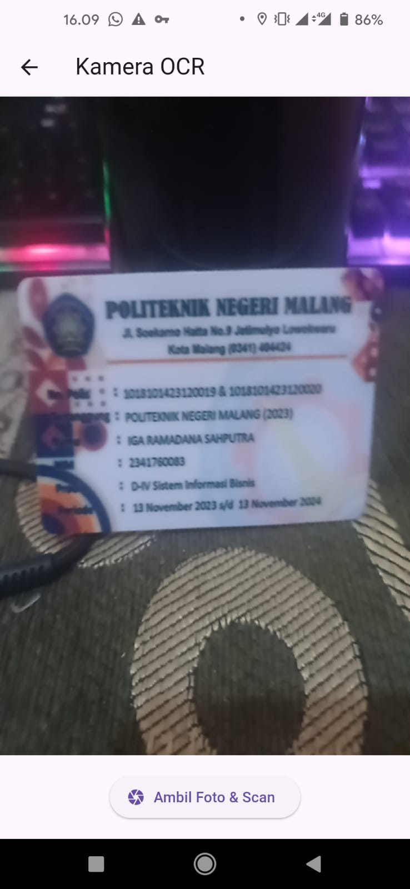
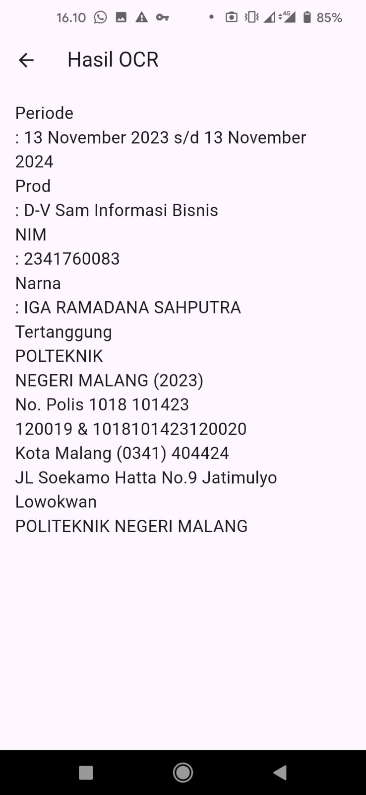

# 📱 Praktikum Flutter — Manajemen Plugin

**Mata Kuliah:** Pemrograman Mobile
**Nama:** Iga Ramadana Sahputra  
**NIM:** 2341760083  
**Kelas:** SIB 3C  
**No Absen:** 15

## **Repository:** [PMB_JS07 - OCR](https://github.com/igaramadana/ocr_sederhana)

---

## Langkah 1: Buat Project Baru

## 

## Langkah 2: Menambahkan Plugin

```dart
dependencies:
 flutter:
 sdk: flutter
 google_mlkit_text_recognition: ˆ0.10.0
 camera: ˆ0.10.5+5
 path_provider: ˆ2.1.2
 path: ˆ1.8.3
```

Simpan lalu jalankan commadn dibawah ini:

```
flutter pub get
```

---

## Langkah 3: Tambahkan Izin Kamera (Android)

Buka file: android/app/src/main/AndroidManifest.xml
Tambahkan baris berikut di dalam tag <manifest>, sebelum <application>:

```dart
<uses-permission android:name="android.permission.CAMERA" />
```

---

## Langkah 4: Buat Struktur Folder

Di dalam folder lib/, buat struktur berikut:

```
lib/
├── main.dart
└── screens/
    ├── splash_screen.dart
    ├── home_screen.dart
    ├── scan_screen.dart
    └── result_screen.dart
```

---

## Langkah 5: Kode Program

lib/main.dart:

```dart
import 'package:flutter/material.dart';
import 'screens/splash_screen.dart';

void main() {
  runApp(const MyApp());
}

class MyApp extends StatelessWidget {
  const MyApp({super.key});

  @override
  Widget build(BuildContext context) {
    return MaterialApp(
      title: 'OCR Sederhana',
      theme: ThemeData(primarySwatch: Colors.blue),
      home: const SplashScreen(),
      debugShowCheckedModeBanner: false,
    );
  }
}

```

lib/screens/splashscreen.dart

```dart
import 'dart:async';
import 'package:flutter/material.dart';
import 'home_screen.dart';

class SplashScreen extends StatefulWidget {
 const SplashScreen({super.key});

 @override
 State<SplashScreen> createState() => _SplashScreenState();
}

class _SplashScreenState extends State<SplashScreen> {
 @override
 void initState() {
   super.initState();
   Timer(const Duration(seconds: 2), () {
     Navigator.pushReplacement(
       context,
       MaterialPageRoute(builder: (context) => const HomeScreen()),
     );
   });
 }

 @override
 Widget build(BuildContext context) {
   return const Scaffold(
     backgroundColor: Colors.blue,
     body: Center(
       child: Column(
         mainAxisAlignment: MainAxisAlignment.center,
         children: [
           CircularProgressIndicator(color: Colors.white),
           SizedBox(height: 20),
           Text(
             'OCR Scanner',
             style: TextStyle(color: Colors.white, fontSize: 24),
           ),
         ],
       ),
     ),
   );
 }
}

```

lib/screens/homescreen.dart:

```dart
import 'package:flutter/material.dart';
import 'scan_screen.dart';

class HomeScreen extends StatelessWidget {
  const HomeScreen({super.key});

  @override
  Widget build(BuildContext context) {
    return Scaffold(
      appBar: AppBar(title: const Text('Menu Utama')),
      body: Center(
        child: ElevatedButton(
          onPressed: () {
            Navigator.push(
              context,
              MaterialPageRoute(builder: (context) => const ScanScreen()),
            );
          },
          child: const Text('Mulai Scan Teks'),
        ),
      ),
    );
  }
}

```

lib/screens/scanscreen.dart:

```dart
import 'dart:io';
import 'package:flutter/material.dart';
import 'package:camera/camera.dart';
import 'package:google_mlkit_text_recognition/google_mlkit_text_recognition.dart';
import 'package:ocr_sederhana/screens/result_screen.dart';

class ScanScreen extends StatefulWidget {
  const ScanScreen({super.key});

  @override
  State<ScanScreen> createState() => _ScanScreenState();
}

class _ScanScreenState extends State<ScanScreen> {
  late List<CameraDescription> _cameras;
  late CameraController _controller;
  late Future<void> _initializeControllerFuture;
  bool _isCameraInitialized = false;

  @override
  void initState() {
    super.initState();
    initCamera();
  }

  void initCamera() async {
    _cameras = await availableCameras();
    _controller = CameraController(_cameras[0], ResolutionPreset.medium);
    _initializeControllerFuture = _controller.initialize().then((_) {
      if (!mounted) return;
      setState(() {
        _isCameraInitialized = true;
      });
    });
  }

  Future<String> _ocrFromFile(File imageFile) async {
    final inputImage = InputImage.fromFile(imageFile);
    final textRecognizer = TextRecognizer(script: TextRecognitionScript.latin);
    final RecognizedText recognizedText = await textRecognizer.processImage(
      inputImage,
    );
    textRecognizer.close();
    return recognizedText.text;
  }

  Future<void> _takePicture() async {
    try {
      await _initializeControllerFuture;

      ScaffoldMessenger.of(context).showSnackBar(
        const SnackBar(
          content: Text('Memproses OCR, mohon tunggu...'),
          duration: Duration(seconds: 2),
        ),
      );

      final XFile image = await _controller.takePicture();
      final ocrText = await _ocrFromFile(File(image.path));

      if (!mounted) return;

      Navigator.push(
        context,
        MaterialPageRoute(builder: (_) => ResultScreen(ocrText: ocrText)),
      );
    } catch (e) {
      if (!mounted) return;
      ScaffoldMessenger.of(context).showSnackBar(
        SnackBar(content: Text('Error saat mengambil/memproses foto: $e')),
      );
    }
  }

  @override
  void dispose() {
    _controller.dispose();
    super.dispose();
  }

  @override
  Widget build(BuildContext context) {
    if (!_isCameraInitialized) {
      return const Scaffold(body: Center(child: CircularProgressIndicator()));
    }
    return Scaffold(
      appBar: AppBar(title: const Text('Kamera OCR')),
      body: Column(
        children: [
          Expanded(
            child: AspectRatio(
              aspectRatio: _controller.value.aspectRatio,
              child: CameraPreview(_controller),
            ),
          ),
          Padding(
            padding: const EdgeInsets.all(16.0),
            child: ElevatedButton.icon(
              onPressed: _takePicture,
              icon: const Icon(Icons.camera),
              label: const Text('Ambil Foto & Scan'),
            ),
          ),
        ],
      ),
    );
  }
}

```

lib/screens/resultscreen.dart

```dart
import 'package:flutter/material.dart';

class ResultScreen extends StatelessWidget {
 final String ocrText;

 const ResultScreen({super.key, required this.ocrText});

 @override
 Widget build(BuildContext context) {
   return Scaffold(
     appBar: AppBar(title: const Text('Hasil OCR')),
     body: Padding(
       padding: const EdgeInsets.all(16.0),
       child: SingleChildScrollView(
         child: SelectableText(
           ocrText.isEmpty ? 'Tidak ada teks ditemukan.' : ocrText,
           style: const TextStyle(fontSize: 18),
         ),
       ),
     ),
   );
 }
}

```

## Tugas Praktikum

1. Jalankan Aplikasi
    

## 📋 Tugas Praktikum & Jawaban

# Analisis Fitur OCR (Optical Character Recognition)

## a. Apakah semua teks terbaca dengan akurat?

**Tidak sepenuhnya akurat.**  
Tingkat keakuratan pembacaan teks sangat bergantung pada beberapa kondisi berikut:

- **Kualitas gambar:** Gambar buram atau beresolusi rendah mengurangi akurasi pembacaan.
- **Sudut pengambilan:** Teks yang diambil dari sudut miring sering terbaca tidak sempurna.
- **Jenis font dan ukuran:** Font yang tidak umum atau ukuran terlalu kecil sulit dikenali.
- **Kontras warna:** Teks dengan kontras rendah terhadap latar belakang sulit diidentifikasi.
- **Kondisi cahaya:** Pencahayaan redup atau silau dapat mengganggu proses deteksi karakter.

---

## b. Apa kegunaan fitur OCR dalam kehidupan sehari-hari?

Fitur **OCR (Optical Character Recognition)** memiliki peran penting dalam berbagai aspek kehidupan modern, di antaranya:

- 📄 **Digitalisasi dokumen:**  
  Mengonversi dokumen fisik seperti struk, faktur, atau formulir ke format digital.

- 🧠 **Aksesibilitas:**  
  Membantu tunanetra dengan mengonversi teks menjadi suara.

- 🏢 **Efisiensi bisnis:**  
  Memproses data dalam jumlah besar, seperti aplikasi bank yang memindai buku tabungan.

- 🎓 **Pendidikan:**  
  Memindai materi textbook untuk dikonversi menjadi catatan digital yang dapat diedit.

- 🔐 **Keamanan:**  
  Verifikasi dokumen identitas seperti KTP atau SIM secara otomatis.

---

## c. Contoh Aplikasi Nyata yang Menggunakan OCR

### 1. Aplikasi Perbankan Digital

Contoh: **Mobile Banking BCA, BRI**

- Fitur scan buku tabungan untuk update saldo otomatis
- Scan **QRIS** untuk pembayaran digital
- Verifikasi **dokumen KTP** untuk pembukaan rekening

### 2. Aplikasi Logistik dan Pengiriman

Contoh: **J&T, SiCepat**

- Scan **resi pengiriman** untuk tracking paket
- Pembacaan **alamat otomatis** dari dokumen
- Verifikasi **tanda terima digital**

### 3. Sistem Parkir Modern

- Pembacaan **plat nomor kendaraan** secara otomatis
- Integrasi dengan **sistem pembayaran digital**
- **Monitoring** kendaraan masuk dan keluar

---

📘 **Kesimpulan:**  
OCR merupakan teknologi penting dalam proses digitalisasi dan automasi berbagai sektor, meningkatkan efisiensi, akurasi, serta aksesibilitas informasi di era modern.
